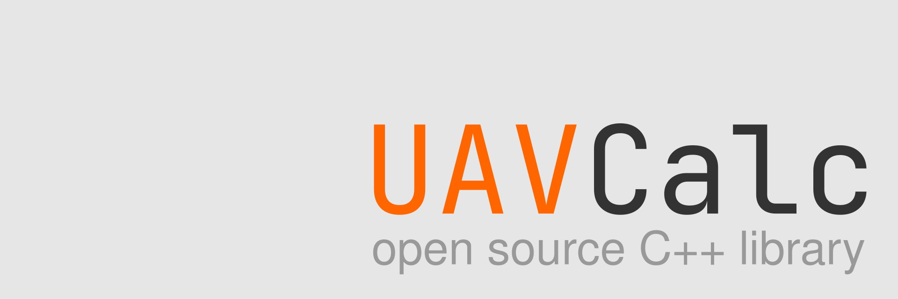

**A C++ physical calculation library for UAV performance and design parameter calculator tools**

#### General Purposes of This Project ####
- To present together the computational tools necessary for unmanned aerial vehicle design
- Creating a resource for our future projects
- and most importantly: improve and learn new things
